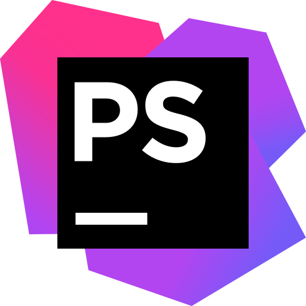

<h1 align="center">Hey, nice to see you </h1>

<h2>🤵 About Me:</h2>

Nice to meet you. My name is Juris. I'm a web and app developer from Latvia. I consider myself as a smart worker and a determined team player. 

Due to the fact that I always had a strong interest in Information Technology and a desire to learn and develop my digital skills, I am highly motivated to succeed in the IT field. Currently working with PHP, MySQL, Laravel. 

I'm always open to learning something new.

 

---

<h2>:wrench: Languages and Tools:</h2>

